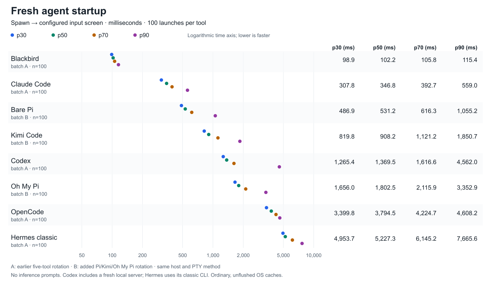

# Eight-tool fresh startup comparison — 2026-10-08

[Full SVG chart](../docs/measurements/agent-startup-total-2026-10-08.svg) · [PNG chart](../docs/measurements/agent-startup-total-2026-10-08.png) · [Numeric results](../docs/measurements/agent-startup-total-2026-10-08.json)

The operator requested bare Pi, Kimi Code and Oh My Pi after the five-tool comparison. 100 additional fresh starts per tool use the same unchanged PTY driver and endpoints. The combined chart has 800 selected launches across eight tools. Batch A is the earlier Blackbird/Codex/Claude/Hermes/OpenCode rotation; batch B is the added Pi/Kimi/Oh My Pi rotation. These were separate runs, not an eight-way simultaneous rotation. No inference prompts were submitted.

## Added configurations

- Bare Pi 1.1.0: isolated npm installation of `@earendil-works/pi-coding-agent@1.1.0` with `--ignore-scripts`; Node 24.7.0. Standard fullscreen TUI and built-in tools, with extensions, skills, MCP, prompt templates, external themes and context-file discovery disabled. Normal startup networking remains enabled; no offline flag. Private auth/settings seed and fresh session state per launch. Input endpoint requires version, model and composer help.
- Kimi Code 2.1.1: installed arm64 Mach-O executable, current CLI command family. Private `KIMI_CODE_HOME`, minimal OpenAI-compatible OpenRouter provider configuration, previously accepted folder trust and existing banner/client caches; explicit empty skills directory, update preflight and telemetry disabled. Expired operator OAuth credentials were not used in repeated launches. Input endpoint requires the configured welcome/model/version and context line. Kimi lazily creates a session on the first submitted message, so typing the unsubmitted marker does not create a model turn.
- Oh My Pi 18.8.4: isolated Bun package installation of `@oh-my-pi/pi-coding-agent@18.8.4`; Bun 1.4.2. External extensions and skills disabled, normal built-in machinery retained. Private config/model credentials, onboarding version 2 prepared beforehand, update checks disabled. Fresh database/catalog initialization is included. Default `startup.showSplash: false`; normal welcome logo animation is retained and runs alongside the composer. Endpoint requires version, Sonnet model label, composer and thinking-effort hint; it does not wait for decorative animation to stop.

All three use OpenRouter `anthropic/claude-sonnet-4.6` with existing API authentication copied privately. Setup/trust/auth preparation and APFS seed cloning are excluded. The workspace and 110×35 Ghostty-identified PTY match batch A. OS caches are ordinary and unflushed. The same parent monotonic clock starts before launcher spawn; the first configured synchronized-update frame is followed by a completed screen row containing `BB_BENCH_READY`, typed without Enter. Earlier tool-specific status commands are not used.

The [earlier report](2026-10-08-agent-startup-comparison.md) contains batch A configuration details. Codex starts its own local server with `--no-daemon` and its endpoint excludes the earlier loading splash; Hermes is the classic Python CLI. These configurations and the separate batches limit what can be inferred from the chart.

## Configured input screen from spawn (ms)

| Tool | Batch | p30 | p50 | p70 | p90 | max |
|---|:---:|---:|---:|---:|---:|---:|
| Blackbird | A | 98.931 | 102.231 | 105.771 | 115.428 | 210.033 |
| Claude Code | A | 307.764 | 346.842 | 392.716 | 558.986 | 3847.130 |
| Bare Pi | B | 486.891 | 531.217 | 616.275 | 1055.236 | 2486.377 |
| Kimi Code | B | 819.818 | 908.239 | 1121.223 | 1850.711 | 4168.018 |
| Codex | A | 1265.395 | 1369.478 | 1616.598 | 4562.046 | 7555.864 |
| Oh My Pi | B | 1656.041 | 1802.545 | 2115.854 | 3352.869 | 5793.897 |
| OpenCode | A | 3399.774 | 3794.499 | 4224.717 | 4608.243 | 9277.945 |
| Hermes classic | A | 4953.665 | 5227.299 | 6145.219 | 7665.620 | 9520.175 |

## Unsubmitted marker visible from spawn (ms)

| Tool | Batch | p30 | p50 | p70 | p90 | max |
|---|:---:|---:|---:|---:|---:|---:|
| Blackbird | A | 100.416 | 103.807 | 107.365 | 116.905 | 214.730 |
| Claude Code | A | 337.621 | 385.113 | 429.971 | 638.103 | 3988.797 |
| Bare Pi | B | 565.222 | 611.802 | 696.914 | 1183.677 | 2630.456 |
| Kimi Code | B | 829.349 | 919.737 | 1137.450 | 1862.698 | 4207.706 |
| Codex | A | 1316.076 | 1436.459 | 1659.862 | 4598.573 | 7600.149 |
| Oh My Pi | B | 1712.762 | 1863.729 | 2162.608 | 3578.689 | 6528.768 |
| OpenCode | A | 3496.232 | 3896.906 | 4311.681 | 4798.681 | 9603.877 |
| Hermes classic | A | 5007.837 | 5303.576 | 6222.462 | 7708.950 | 9621.021 |

## Marker response after typing (ms)

| Tool | Batch | p30 | p50 | p70 | p90 | max |
|---|:---:|---:|---:|---:|---:|---:|
| Blackbird | A | 0.624 | 0.721 | 0.902 | 1.297 | 2.551 |
| Claude Code | A | 30.317 | 36.317 | 37.511 | 65.960 | 228.083 |
| Bare Pi | B | 76.702 | 79.484 | 87.317 | 120.845 | 501.812 |
| Kimi Code | B | 10.087 | 12.410 | 16.066 | 22.743 | 40.743 |
| Codex | A | 39.930 | 42.942 | 49.587 | 64.988 | 176.607 |
| Oh My Pi | B | 45.553 | 54.080 | 66.947 | 124.563 | 1652.129 |
| OpenCode | A | 76.205 | 86.619 | 100.551 | 120.164 | 324.579 |
| Hermes classic | A | 47.896 | 65.252 | 72.765 | 83.062 | 139.473 |

## Endpoint and shutdown observations

| Tool | Recorded | Endpoint success | Forced shutdown | Nonzero exit |
|---|---:|---:|---:|---:|
| Blackbird | 100 | 100 | 0 | 0 |
| Claude Code | 100 | 100 | 0 | 0 |
| Bare Pi | 100 | 100 | 0 | 0 |
| Kimi Code | 100 | 100 | 0 | 0 |
| Codex | 100 | 100 | 100 | 100 |
| Oh My Pi | 100 | 100 | 6 | 6 |
| OpenCode | 100 | 100 | 0 | 0 |
| Hermes classic | 100 | 100 | 0 | 0 |

Shutdown uses local quit keys and a three-second drain before terminating the private process group if needed. Its duration is excluded from startup/input percentiles. Endpoint success does not imply a graceful exit. All selected records, including failures and outliers if present, remain in the numeric artifacts; percentiles use successful endpoint records. No retries replace selected observations.

One Pi/Kimi endpoint pilot and one Oh My Pi endpoint pilot are preserved separately. Earlier untimed probes reached the trust/setup screens; those were configuration preparation, not timed startup samples. Private transcripts and isolated installations remain in ignored `context/agent-startup-pi-kimi-omp-2026-10-08/`. Temporary credential copies were removed afterward. Original account files and retained quarantine sources were not changed.

The combined artifact identifies each source batch and its metadata/driver hash. Both use nearest-rank p30/p50/p70/p90; maxima are retained in the tables and samples. The chart uses a logarithmic time axis and displays the rounded numeric percentiles alongside the points. These are observed startup/input distributions for the specified configurations, without causal runtime, inference or coding-speed claims.

Configuration sources: [Pi upstream](https://github.com/earendil-works/pi), [Kimi environment variables](https://www.kimi.com/code/docs/en/kimi-code-cli/configuration/env-vars), [Kimi providers](https://www.kimi.com/code/docs/en/kimi-code-cli/configuration/providers), [Oh My Pi upstream](https://github.com/can1357/oh-my-pi). Installed help, package manifests and retained source informed the actual adapters; executable and install-lock identities are recorded in the added numeric artifact.
